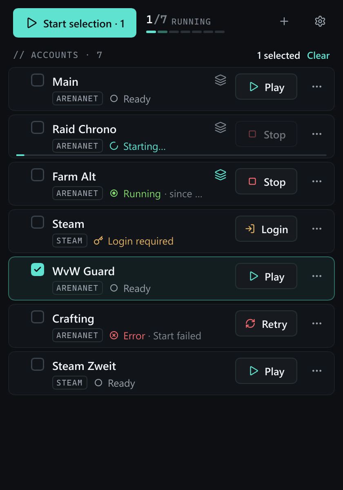
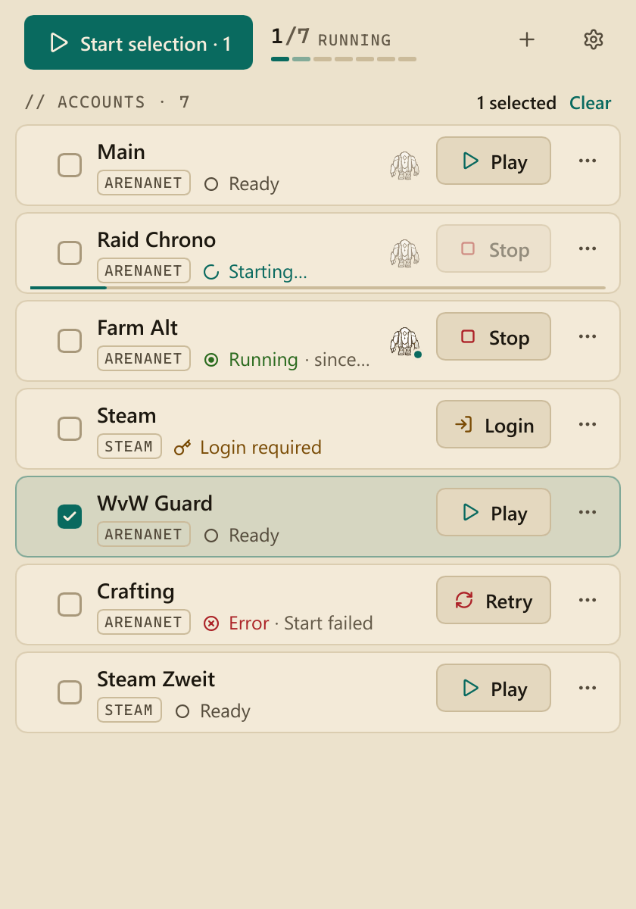

<div align="center">

# Breakbar Launcher

**A fast, lightweight multi-launcher for Guild Wars 2 on Windows.**

[](https://github.com/breakbarcc/breakbar-launcher/actions/workflows/ci.yml)
[](LICENSE)





</div>

Breakbar Launcher starts several Guild Wars 2 clients side by side, each with its own account, and
keeps them organized. It is a native Rust program that reacts to events instead of polling, so it
uses almost no CPU while idle.

> [!NOTE]
> Breakbar Launcher is in early development (version 0.x). Things may change between versions, see
> the [changelog](CHANGELOG.md). There are no releases yet: you build it yourself (see
> [Building](#building)).

## Features

- **Multi-launch:** start as many clients as you like, one click for all or a selection of them.
- **Separate logins without stored passwords:** every account gets its own `Local.dat`. Breakbar
  never stores an email or a password.
- **ArenaNet and Steam accounts** side by side. A Steam account can use your existing ArenaNet
  installation, Breakbar sets up the link to Steam for you.
- **Companion apps:** start and stop programs such as [Blish HUD](https://blishhud.com/) together
  with the game, once per client or once for all.
- **Instance switcher:** a small always-on-top bar with a numbered chip per account to jump between
  running clients.
- **Runs in the background:** tray icon, optional start with Windows, and a choice of what the
  window does after starting an account.
- **Desktop shortcuts** and a [command line](#command-line) to start accounts without opening the window.
- **Dark and light theme** (or follow Windows), English and German.
- **Loading screen FPS limit** (`-fps`), 60, 30 or unlimited.

## How multi-launching works

Guild Wars 2 holds a named mutex (`AN-Mutex-Window-Guild Wars 2`) to prevent a second instance and
locks `Gw2.dat`. Breakbar closes that mutex handle inside the client that is already running and
starts new clients with `-shareArchive`, which opens `Gw2.dat` read-only. The game executable is
never modified.

Each account's login lives in its own profile folder; Breakbar points the game's data folder at the
account's profile for the few seconds a client needs to start. More details are in
[docs/ARCHITECTURE.md](docs/ARCHITECTURE.md).

## Getting started

1. Start Breakbar Launcher. On the first start it looks for your Guild Wars 2 installation (the
   `Gw2-64.exe`) and asks you to confirm it.
2. Add an account. The name is only a label for you.
3. Set up its login once: the normal Guild Wars 2 login opens, log in with *Remember
   email/password* ticked and close the client normally. From then on the account starts and logs
   in on its own.
4. Press **Launch all**, or select some accounts and press **Start selection**.

> [!TIP]
> `-autologin` is not fully reliable in the game itself. If a client stays on the login screen with
> your data filled in, just press the login button.

### Steam accounts

Steam signs the game in with the Steam user that is currently signed in, so only one Steam account
can run at a time (next to any number of ArenaNet accounts). Steam has to be running.

Steam only signs in a copy of the game that it installed itself. If you have the standalone
(ArenaNet) version, Breakbar offers to link that installation into Steam with a directory junction;
you then press *Install* in Steam once, and Steam adopts the existing files instead of downloading
the game again.

### Command line

```text
breakbar-launcher --launch "Main,Alt1"   Start accounts by name without opening the window
breakbar-launcher --launch-id 2          Start the account with this id (used by desktop shortcuts)
breakbar-launcher --help                 Show all options
breakbar-launcher --version              Show the version
```

## Where your data lives

| What | Where |
|---|---|
| Settings and accounts | `%APPDATA%\Breakbar\config.toml` |
| Per-account profiles (`Local.dat`, settings) | `%LOCALAPPDATA%\Breakbar\profiles\<account id>` |

Deleting an account in Breakbar also deletes its profile folder.

## Building

Requirements: Windows 10/11 x64, [Rust](https://rustup.rs) (MSVC toolchain, stable) and the Visual
Studio Build Tools with the C++ workload.

```bash
git clone https://github.com/breakbarcc/breakbar-launcher.git
cd breakbar-launcher
cargo run --release
```

`cargo build --release` puts the program at `target\release\breakbar-launcher.exe`.

Before you commit changes, run the checks the CI runs:

```bash
cargo fmt --all --check
cargo clippy --all-targets -- -D warnings
cargo test
```

## Documentation

- [docs/ARCHITECTURE.md](docs/ARCHITECTURE.md): how it works, decisions, roadmap
- [CHANGELOG.md](CHANGELOG.md): what changed in which version
- [CONTRIBUTING.md](CONTRIBUTING.md): contributing and versioning rules

## Contributing

Issues and pull requests are welcome. Please read [CONTRIBUTING.md](CONTRIBUTING.md) first; by
submitting a pull request you agree that your contribution is licensed under the project's MIT
License.

## License

Breakbar Launcher is released under the [MIT License](LICENSE).

The user interface is built with [Slint](https://slint.dev) under its royalty-free license.

[](https://slint.dev)

## Disclaimer

Breakbar Launcher is a fan project by [breakbar.cc](https://www.breakbar.cc/) and not an official
Guild Wars 2 product. Guild Wars 2 is a trademark of ArenaNet, LLC. This project is not affiliated
with ArenaNet or NCSOFT.
